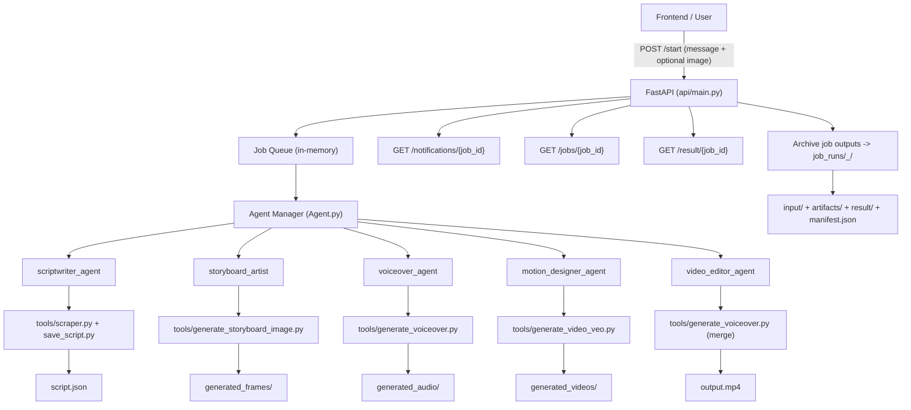

# AI News Video Studio (ET)

## Problem Statement

**AI News Video Studio — Automatically transform any ET article or breaking news into a broadcast-quality short video (60–120 seconds) with AI-generated narration, animated data visuals, and contextual overlays.**

## What We Built

We built a Manager + Specialist multi-agent pipeline that converts an article URL into a short-form news video.

High-level flow:
1. Scrape article and generate structured script (`script.json`)
2. Generate storyboard frames (`generated_frames/frame_1..8.jpg`)
3. Generate continuous narration (`generated_audio/full_narration.wav`)
4. Generate motion clips (`generated_videos/sense_1..8.mp4`)
5. Merge clips + narration into final video (`output.mp4`)

Then we wrapped the pipeline with a FastAPI service so frontend can:
- Start jobs
- Poll concise notifications
- Fetch final output video

## Solution Architecture



## Modes

### Real Mode (`DRY_RUN=0`)
- Runs real agent + tools.
- Uses configured model credentials.
- Produces actual generated outputs.

### Dry Mode (`DRY_RUN=1`)
- No model/tool API calls.
- Replays sample assets from `samples/dry_run`.
- Useful for frontend testing without credit usage.

## API Overview

Base service: `api/main.py`

Endpoints:
- `POST /start`
- `GET /notifications/{job_id}?after=<seq>`
- `GET /jobs/{job_id}`
- `GET /result/{job_id}`
- `GET /health`

Detailed API contract is documented in:
- `api/README.md`

## Project Structure (Important)

- `Agent.py` - Manager + skill orchestration
- `skills/*.md` - Specialist definitions
- `tools/*.py` - Tool implementations
- `api/main.py` - HTTP API
- `samples/dry_run/` - Offline dry-run dataset
- `job_runs/` - Archived output bundles per completed job
- `cleanup.py` - Cleanup utility

## Required Environment Keys

Create `.env` from `.env.example`.

Required for real generation:
- `VITE_VERTEX_API_KEY`
- `VITE_GOOGLE_CLOUD_PROJECT`
- `VITE_GOOGLE_CLOUD_LOCATION`

Runtime/API keys:
- `DRY_RUN`
- `CLEAN_AFTER_ARCHIVE`
- `NOTIFICATION_INTERVAL_SECONDS`
- `REAL_MEMORY_POLL_SECONDS`
- `API_HOST`
- `API_PORT`
- `API_RELOAD`

Optional model overrides:
- `VITE_GOOGLE_GENAI_USE_VERTEXAI`
- `VITE_GEMINI_VOICE_MODEL_AUDIO`
- `VITE_GEMINI_VISION_MODEL`

## Setup and Run

### Prerequisites

- `uv` installed (Python dependency manager)
- Node.js + npm installed (for frontend)

### 1) Configure Environment (project root)

```powershell
copy .env.example .env  # first time only
```

Then edit `.env`:
- Keep `VITE_API_BASE_URL=http://127.0.0.1:8000`
- Use `DRY_RUN=1` for frontend/API testing without model credits
- Use `DRY_RUN=0` for real generation

### 2) Run Backend API

Option A (Windows helper script):

```bat
run_all.bat
```

What `run_all.bat` does:
1. Verifies `uv` is installed
2. Creates `.env` from `.env.example` if missing
3. Runs `uv sync`
4. Ensures runtime folders exist
5. Starts API (`uv run main.py` from `api/`)

Option B (manual):

```powershell
# from project root
uv sync
cd api
uv run main.py
```

Backend default URL: `http://127.0.0.1:8000` (or `http://localhost:8000`)

### 3) Run Frontend (second terminal)

```powershell
cd Frontend
npm install
npm run dev
```

Frontend default URL: `http://localhost:5173`

### 4) Verify End-to-End

1. Open `http://localhost:5173`
2. Submit a prompt (and optional reference image)
3. Frontend calls API at `VITE_API_BASE_URL` (default `http://127.0.0.1:8000`)

## Frontend Polling Sequence

1. `POST /start` with `message` and optional `image`
2. Poll `GET /notifications/{job_id}?after=<last_seq>`
3. Poll `GET /jobs/{job_id}` until `status=completed`
4. Fetch video from `GET /result/{job_id}`

## Cleanup

To remove generated/archived outputs and keep repo clean:

```powershell
python cleanup.py
```

Dry-check cleanup first:

```powershell
python cleanup.py --dry-run
```

## Operational Recovery Rule

If context/memory is reset, bootstrap from docs in this order:
1. `README.md` (this file)
2. `api/README.md` (full API behavior)
3. `.env.example` (required keys and defaults)
4. `run_all.bat` (setup/run path)

## Technical Depth & Architecture

- Multi-agent orchestration pattern: Manager delegates to specialist skills (`scriptwriter`, `storyboard`, `voiceover`, `motion`, `video_editor`) with explicit handoff and memory-backed step tracking.
- Tool isolation and execution boundary: skills call standalone Python tools via subprocess, keeping generation, media operations, and orchestration decoupled and replaceable.
- API-first runtime: FastAPI layer abstracts orchestration into async job APIs (`/start`, `/notifications`, `/jobs`, `/result`) for frontend consumption.
- Dual execution modes: real mode for production generation and sample-driven dry mode (`DRY_RUN=1`) for zero-credit integration testing.
- Deterministic output governance: per-job archive bundles (`job_runs/<timestamp>_<jobid>`) with `input/`, `artifacts/`, `result/`, and `manifest.json` for auditability and reproducibility.
- Notification architecture: short state emissions from memory/tool milestones plus configurable heartbeat interval for predictable frontend progress UX.

## Real Business Impact

- Faster newsroom turnaround: transforms article-to-video from manual multi-step editing into an API-triggered automated pipeline.
- Lower production bottlenecks: standardizes script, frame, voice, motion, and assembly flow to reduce dependence on sequential manual handoffs.
- Scalable content throughput: job-based API enables queue-driven integration with web/mobile publishing workflows.
- Better product reliability: dry-run replay enables frontend and QA validation without burning model credits.
- Operational traceability: archived job artifacts simplify debugging, compliance review, and postmortem analysis.
- Cost control levers: configurable dry-run mode, cleanup strategy, and reusable sample assets reduce test-cycle spend.

## Innovation

- Hybrid creative + deterministic pipeline: combines generative media stages with strict structural constraints (scene counts, durations, output contracts).
- Style-in-the-loop API interface: single message + optional reference image enables guided visual consistency without custom frontend logic.
- Production-like simulation mode: sample replay mimics real pipeline outputs and notifications, enabling realistic environment testing before model calls.
- Built-in lifecycle management: automatic archiving and optional workspace cleanup turn generated assets into manageable, auditable run artifacts.
- Extensible specialist model: new capabilities can be added by dropping markdown skills and tool scripts without rewriting the API surface.
